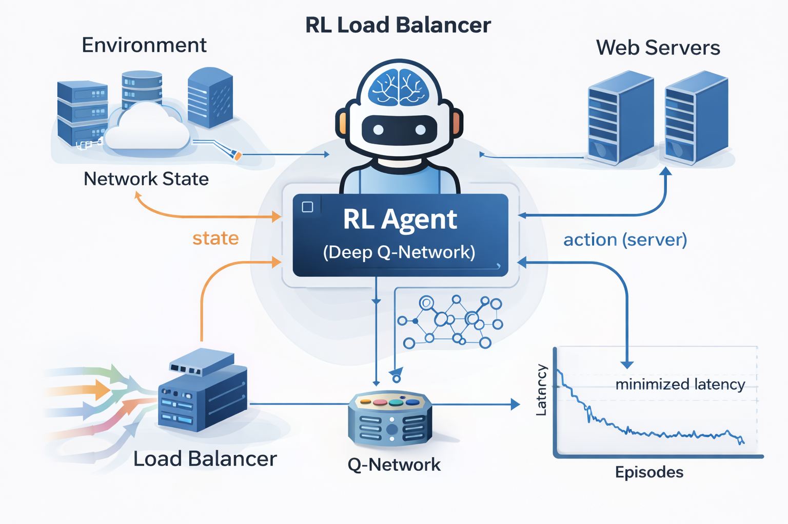

# 🚀 Network Traffic Load Balancer using RL Agent

---

## 📌 Overview

This project implements a **Reinforcement Learning-based Load Balancer** using a Deep Q-Network (DQN) agent.  
The system dynamically distributes network traffic across servers to minimize latency and improve performance.

---

## 🧩 System Architecture

### 🔹 Load Balancing Architectures

<p align="center">
  
  
</p>

<p align="center">
<b>Figure:</b> Comparison between RL-based load balancing and traditional load balancing techniques.
</p>

---

### ⚙️ How It Works

- Incoming network traffic enters the environment
- The environment computes the current state (load, latency)
- The DQN agent selects the optimal server
- The system returns a reward based on latency performance
- The agent continuously improves decisions via feedback loop

---

## 🎯 Objectives

* Reduce network congestion
* Optimize server utilization
* Minimize response latency
* Learn adaptive routing policies

---

## 🧠 Methodology

The system uses **Deep Reinforcement Learning (DQN)**:

* Environment simulates network traffic
* Agent observes system state (load, latency)
* Agent selects best server (action)
* Reward based on performance (latency reduction)

---

## ⚙️ How to Run

```bash
pip install -r requirements.txt
python train.py
python plot.py
```

---

## 📊 Results

### 🔹 Final Performance


### 🔹 Training Output


---

## 📁 Project Structure

```
network-traffic-load-balancer-rl/
│
├── env.py               # Environment simulation
├── dqn_agent.py         # RL Agent (DQN)
├── train.py             # Training script
├── evaluate.py          # Model evaluation
├── utils.py             # Helper functions
│
├── results/
│   ├── final_results.png
│   └── terminal_output.png
│
├── images/              # README images (optional)
│
├── requirements.txt     # Dependencies
└── README.md            # Documentation
```

---

## 📈 Key Features

* Deep Q-Learning implementation
* Adaptive load balancing
* Performance visualization
* Scalable design

---

## 🛠️ Technologies Used

* Python
* NumPy
* Matplotlib
* Reinforcement Learning (DQN)

---

## 🔮 Future Improvements

* Use **Advanced RL (PPO / A3C)**
* Real-world network integration
* GUI dashboard for monitoring
* Multi-agent system

---

## 👨‍💻 Author

Karrar Haider 

---

## ⭐ Support
